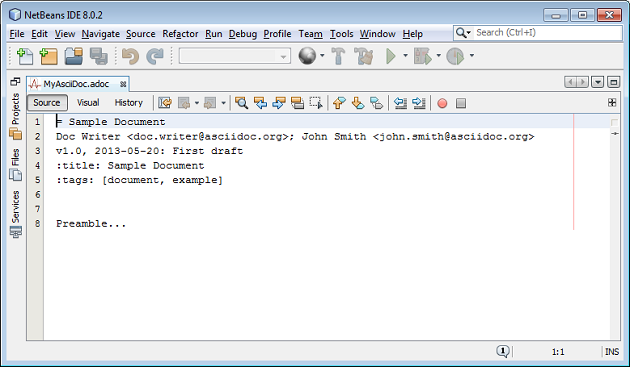
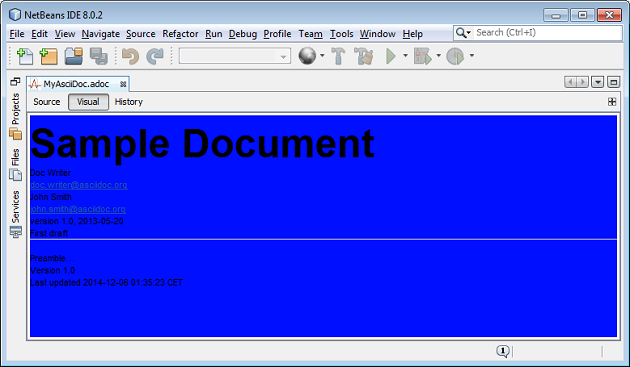

View this project on [CADLAB.io](https://cadlab.io/node/887). 

# AsciidoctorJ4NB

NetBeans plugin that integrates AsciidoctorJ

To do:

- [X] progress bar
- [X] synchronization
- [ ] rendering options
- [ ] syntax coloring using https://github.com/asciidocj/asciidocj
- [ ] explore reusing https://github.com/madflow/flow-netbeans-markdown
